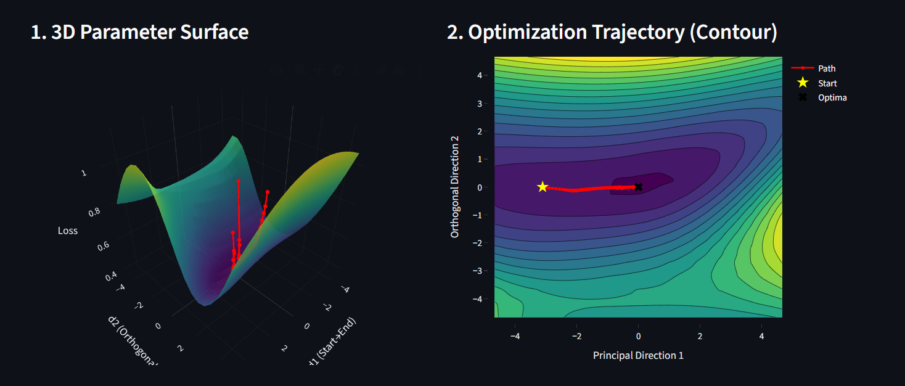

# Neural Network Loss Landscape Visualization

## Overview
## Loss Landscape Visualization




This project provides an interactive visualization of neural network **loss landscapes** and compares how different optimization algorithms navigate the parameter space during training.

The goal is to help understand **how optimizers like SGD, RMSProp, and Adam move across the loss surface** while minimizing the training error.

The system visualizes:

* 3D loss landscape of model parameters
* Optimization trajectories
* Decision boundaries in feature space
* Convergence diagnostics (loss and gradient norms)

This project is designed as an **educational tool for understanding neural network optimization dynamics**.

---

## Key Concepts

### Loss Landscape

The **loss landscape** represents how the model's error changes with respect to its parameters.

* High regions → high error
* Low valleys → optimal solutions

Training a neural network is equivalent to **finding the lowest point in this landscape**.

---

### Optimizers

Optimizers determine how the neural network updates its parameters during training.

This project compares three widely used optimizers:

* **SGD (Stochastic Gradient Descent)**
  Takes fixed steps along the gradient direction.

* **RMSProp**
  Adapts the learning rate based on recent gradient magnitudes.

* **Adam**
  Combines momentum and adaptive learning rates for faster convergence.

---

## Visualizations

### 1. 3D Parameter Surface

Displays the **loss surface** of the neural network projected onto two principal directions in parameter space.

The optimization path is shown to illustrate how the model moves toward the minimum loss.

---

### 2. Optimization Trajectory (Contour Plot)

A top-down contour view of the loss landscape showing:

* Starting point of optimization
* Path taken by the optimizer
* Location of the optimal minimum

---

### 3. Decision Boundary (Feature Space)

Shows how the trained neural network separates two classes in feature space.

* Red points → Class 0
* Blue points → Class 1

The background color indicates the predicted class regions.

---

### 4. Convergence Diagnostics

Training behavior is monitored through:

* **Binary Cross Entropy (BCE) Loss vs Epochs**
* **Gradient Norm vs Epochs**

These graphs help analyze training stability and optimizer performance.

---

## Features

* Interactive optimizer selection (SGD / RMSProp / Adam)
* Adjustable learning rate
* Adjustable training epochs
* Real-time visualization of optimization behavior
* Decision boundary visualization
* Convergence diagnostics

---

## Project Structure

```
project/
│
├── app.py                # Main visualization application
├── model.py              # Neural network model definition
├── optimizer_utils.py    # Optimizer implementations
├── loss_landscape.py     # Loss landscape generation
├── visualization.py      # Plotting and visualization logic
└── README.md
```

---

## Installation

Clone the repository:

```
git clone https://github.com/yourusername/loss-landscape-visualization.git
cd loss-landscape-visualization
```

Install dependencies:

```
pip install -r requirements.txt
```

---

## Running the Application

Run the visualization app:

```
python app.py
```

The interface will open where you can:

* Select optimizer
* Adjust learning rate
* Change number of training epochs
* Observe optimizer behavior on the loss landscape

---

## Technologies Used

* Python
* PyTorch / TensorFlow (depending on implementation)
* NumPy
* Matplotlib / Plotly
* Streamlit (for interactive UI)

---


---

## Learning Outcomes

This project helps understand:

* Neural network optimization
* Loss landscape geometry
* Differences between optimization algorithms
* Training stability and convergence behavior

---

## License

This project is released under the MIT License.

---

## Author

Manoj
Computer Science Student
